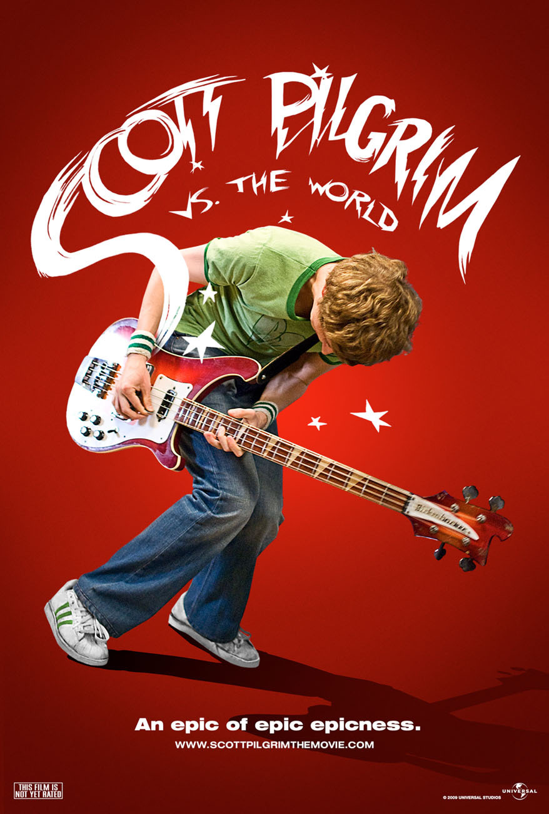

<html>
  <head>
    <link rel="shortcut icon" type="image/x-icon" href="favicon.ico">
    <title>Sonntagsfilm</title>
    <meta name="viewport" content="width=device-width, initial-scale=1" />
    
  </head>
  <body
    style="background-color: #f6f6f6"
    style="font-family: 'Segoe UI', Tahoma, Geneva, Verdana, sans-serif"
  >
    <h1>Sonntagsfilm 1</h1>
    

      Liebe:r [Name einfügen], 
       
      ganz herzlich lade ich dich zu einer Ausgabe "Sonntagsfilm" zu mir ein.
      Wir werden in Kino-Atmospähre einen Film schauen, den wir im Vorfeld
      ausgesucht haben. Dabei starten wir ganz flexibel. Mittags, Nachmittags,
      Abends, ... je nachdem wie es am Samstag so lief. Den Termin können wir
      aber schon lange vorher festlegen. Es gibt Soft-Drinks und Knabberzeug.
      Alles wird schon bereit sein, wenn du kommst. Im Anschluss werden wir über
      den Film diskutieren. Oder auch nicht. Ist voll egal! Du kannst alleine
      kommen oder eine weitere Person mitbringen. In Ausnahmefällen (mit
      Begründung) können wir uns auch zu Viert treffen. Mehr passt nicht auf
      meine Couch. 
       
      Herzliche Grüße, Tobaies
    

     
    <h2>Ich benötige folgende Infos:</h2>
    

      

        <input type="text" id="txtName" placeholder="Name oder Alias" />
      

      

        <input
          type="text"
          id="txtFilm1"
          placeholder="Wunschfilm (was immer du auch möchtest)"
        />
      

      

        <input
          type="text"
          id="txtFilm2"
          placeholder="Alternativer Wunschfilm"
        />
      

      

        <select id="Sonntag">
          <option selected value="">-- Welcher Sonntag? --</option>
          <option value="12.09.21">12. September 2021</option>
          <option value="19.09.21">19. September 2021</option>
          <option value="26.09.21">26. September 2021</option>
        </select>
      

      

        <select id="Getränke">
          <option selected value="">-- Bevorzugtes Getränk --</option>
          <option value="Limo">Limo</option>
          <option value="Cola">Cola</option>
          <option value="Bier">Bier</option>
          <option value="nix">nichts davon</option>
        </select>
      

      

        <select id="Speisen">
          <option selected value="">-- Bevorzugte Speise --</option>
          <option value="Pop süß">Popcorn süß</option>
          <option value="Pop salzig">Popcorn salzig</option>
          <option value="Chips">Chips</option>
          <option value="nix">nichts davon</option>
        </select>
      

      

        <input type="text" id="txtComment" placeholder="Optionaler Kommentar" />
      

      

        <input type="button" id="bt" value="Absenden" onclick="saveFile()" />
      

    

     
     
    
    <!---->
    
    
     
  </body>
  
</html>
